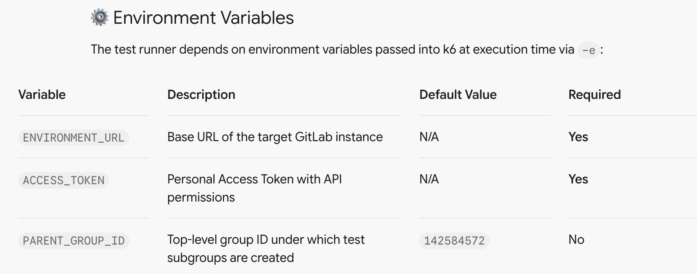

# gitlab-automation

https://gitlab.com/gitlab-org/quality/performance/-/tree/main?ref_type=heads
https://gitlab.com/gitlab-org/security-products/demos/analyzer-configurations/kics/iac-getting-started

## 🛡 Security & Vulnerability Management

This repository is configured with automated security scanning and direct vulnerability reporting mechanisms:

* **Security Policy & Advisories:** Security policy guidelines and advisories are active. Details on how to safely report security issues can be found in [SECURITY.md](./SECURITY.md) or via the repository's **Security** tab.
* **Private Vulnerability Reporting:** Enabled. Security researchers and community members can privately disclose potential vulnerabilities directly to maintainers.
* **Dependabot Alerts:** Enabled. Automatically monitors third-party dependencies and triggers alerts upon detecting known vulnerabilities.
* **Code Scanning Alerts:** Enabled. Automatically analyzes code pushes and pull requests to detect common code errors, anti-patterns, and security defects.
* **Secret Scanning Alerts:** Enabled. Continuously scans commits for exposed API keys, private tokens, and credentials.

# GitLab Security Policy Test Automation Suite

An automated performance and validation testing framework built with [k6](https://k6.io/) to verify end-to-end execution of GitLab Security Policy scanners (Secret Detection, Semgrep SAST, and KICS IaC SAST).

---

## 🏗 Project Architecture

The codebase follows a modular design pattern separating test orchestration, API interactions, pipeline polling, job validation, and test data fixtures.

.
├── tests/
│   └── security_policy_test.js      # Main k6 test execution script (setup + default function)
├── lib/
│   ├── gitlab_api_helpers.js        # GitLab REST API wrappers (commits, MRs, artifacts)
│   ├── pipeline_helpers.js          # Pipeline polling & lifecycle state management
│   ├── security_job_validators.js   # Generic validation logic for CI jobs & security reports
│   ├── test_data_helpers.js         # Security rule sets, vulnerable fixtures, and CI YAML templates
│   ├── gpt_custom_helper_functions.js
│   └── gpt_scenario_functions.js
├── run-test.sh                      # Helper wrapper script for k6 execution
└── README.md                        # Documentation

---

## 🛠 Prerequisites

Ensure you have the following installed locally before running the tests:

1. **k6**: Installation options:
* **macOS (Homebrew):**
bash
brew install k6

* **Linux (Debian/Ubuntu):**
bash
gpg --no-default-keyring --keyring /usr/share/keyrings/k6-archive-keyring.gpg --keyserver hkp://keyserver.ubuntu.com:80 --recv-keys C5AD17C747E3415A3642D57D77C6C491D6AC1D69
echo "deb [signed-by=/usr/share/keyrings/k6-archive-keyring.gpg] [https://dl.k6.io/deb](https://dl.k6.io/deb) stable main" | sudo tee /etc/apt/sources.list.d/k6.list
sudo apt-get update
sudo apt-get install k6

* **Windows (Chocolatey):**
bash
choco install k6

2. **GitLab Personal Access Token (PAT):**
* Requires `api`, `read_repository`, and `write_repository` scopes.

---

---

## 🚀 Running Tests Locally

### Option 1: Using the `run-test.sh` Wrapper (Recommended)

Make sure the script is executable:

bash
chmod +x run-test.sh

./run-test.sh security_policy_test

Execute the security policy test suite:

bash
ENVIRONMENT_URL="[https://gitlab.example.com](https://gitlab.example.com)" \
ACCESS_TOKEN="your_gitlab_access_token" \
./run-test.sh security_policy_test

### Option 2: Running directly with `k6` CLI

bash
k6 run \
  -e ENVIRONMENT_URL="[https://gitlab.example.com](https://gitlab.example.com)" \
  -e ACCESS_TOKEN="your_gitlab_access_token" \
  -e PARENT_GROUP_ID="142584572" \
  tests/security_policy_test.js

---

## 📊 Test Workflow & Assertion Logic

Each execution carries out an end-to-end scenario:

1. **Setup Phase (`setup()`):**
* Creates a unique temporary subgroup and project under `PARENT_GROUP_ID`.
* Commits CI configuration (`.gitlab-ci.yml`) alongside mock vulnerability fixtures (leaked AWS keys, vulnerable Python code, misconfigured Terraform S3 buckets).
* Opens a Merge Request to trigger pipeline execution.

2. **Execution Phase (`default` function):**
* Polls the GitLab REST API until the MR pipeline initializes and completes.
* Retrieves pipeline job lists and JSON artifact reports (`gl-secret-detection-report.json`, `gl-sast-report.json`).

3. **Validation Phase (`validateSecurityJob`):**
* Asserts job presence and `success` status for `secret_detection`, `semgrep-sast`, and `kics-iac-sast`.
* Verifies that security reports are correctly formatted and contain detected vulnerabilities (`vulnerabilities.length > 0`).

---

## 🧹 Code Quality & Standards

This project adheres to the following standards:

* **Goja Runtime Compatibility:** Standard string keys (e.g., `"[Job] " + jobName + " exists"`) are used for `check()` dynamic keys to prevent parsing errors on k6's ES5/6 engine.
* **SonarQube DRY Compliance:** Uses a single generic validator (`validateSecurityJob`) across security scanners to prevent code duplication.
* **Modern ES6 Syntax:** Uses `const` for immutable metric bindings, `for...of` loops for array iteration, and `/20[01]/` character classes for regex status validation.
EOF

